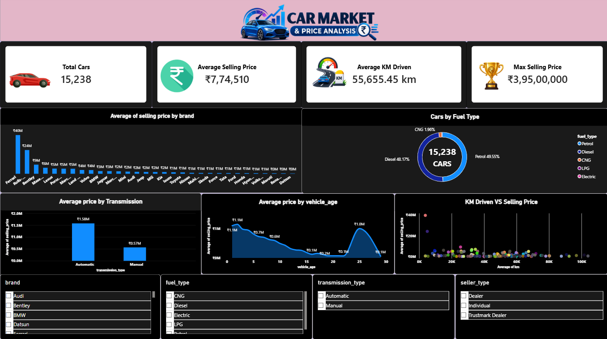

# 🚗 Car Market & Price Analysis

## 📌 Project Overview

Car Market & Price Analysis is a data analytics project that explores used-car market data to understand pricing patterns, customer preferences, vehicle characteristics, and factors that influence selling prices.

The project uses Python, SQL, Excel, and Power BI to perform data cleaning, exploratory data analysis, visualization, and dashboard development.

---

## 🎯 Objectives

- Analyze the used-car market based on different vehicle characteristics.
- Identify the most common car brands and fuel types.
- Compare average selling prices across brands and transmission types.
- Understand the relationship between vehicle age and selling price.
- Analyze how mileage, engine size, and maximum power relate to selling price.
- Build interactive dashboards for business insights.

---

## 🛠️ Tools & Technologies

- **Python** — Pandas, Matplotlib
- **SQL** — MySQL
- **Excel** — Pivot Tables, Charts, Dashboard
- **Power BI** — Interactive Dashboard & Data Visualization
- **Git & GitHub** — Version Control

---

## 📊 Dataset

The dataset contains used-car information including:

- Car Name
- Brand
- Model
- Vehicle Age
- Kilometers Driven
- Seller Type
- Fuel Type
- Transmission Type
- Mileage
- Engine
- Maximum Power
- Seats
- Selling Price

After data cleaning, the final dataset contains **15,238 records and 13 columns**.

---

## 🔄 Project Workflow

```text
Raw Dataset
     ↓
Data Cleaning
     ↓
Exploratory Data Analysis
     ↓
SQL Analysis
     ↓
Excel Analysis & Dashboard
     ↓
Power BI Dashboard
     ↓
Business Insights


## 📊 Power BI Dashboard

